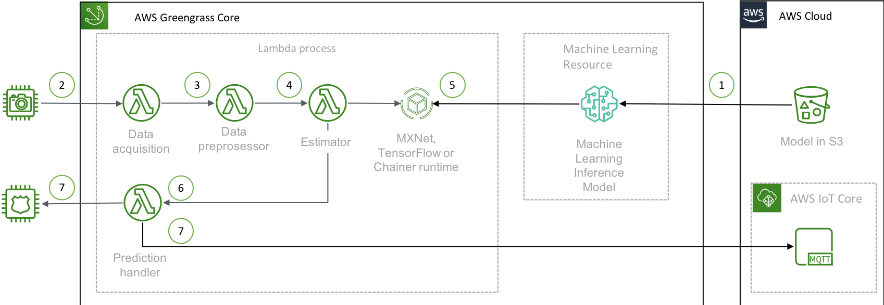
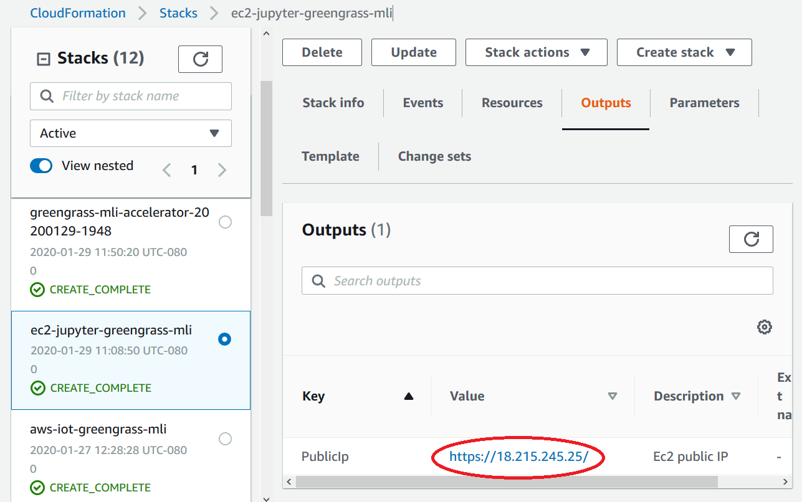

# Learn The Essentials Of ML Inference With AWS IoT GreenGrass


This workshop teaches how to run Machine Learning Inference at Edge with AWS IoT Greengrass using [AWS IoT Greengrass Accelerator](https://github.com/awslabs/aws-iot-greengrass-accelerators/tree/master/accelerators/machine_learning_inference).

In a real world senario, you'd deploy the Greengrass Core on a physical device. For this workshop, we will use an EC2 instance that simulate a device and deploy the Greengrass core to it.


## Design Pattern



The common design patterns of using a pre-trained model in S3 bucket:

1. When the Greengrass configuration is being deployed, the Greengrass Core will download the model from the S3 bucket as configured in the Machine Learning Resources, to the local disk, and extract the files from the compressed `.tar.gz` or `.zip`.
2. **Data acquisition** - This function periodically acquire the raw data inputs from a image source. In this example, we are using static images to simulate image sources.
3. **Data preprocessor** - This function pre-process the image by resize to the images used to train the model.
4. **Estimator** - This function predict the data input with data loaded in MXNet runtime
5. The MXNet runtime loads the model from the local path 
6. The process will handle the prediction result, with object detected and confidence level.
7. The result can be used to trigger an action, or send it back to the cloud for further processing.


## Roadmap of the Workshop

**Prerequisite**: Create a key pair or use existing one. The key pair has to exist in the region you will be provisioning the following EC2 instances. 

1. Run the first CloudFormation template, [**aws-iot-greengrass-mli**](cfn/greengrass_core_on_ec2-s3_models.cfn.yml) in Step 1. This template starts up an EC2 instance that acts as a Thing/device. 

1. Run the second CloudFormation template, [**ec2-jupyter-greengrass-mli**](cfn/jupyter-ec2.yaml) in Step 2. This template starts up an EC2 instance that hosts Jupyter Notebook where you create artifacts to comfigure the Greengrass Core and deploy the software to the device or EC2. 

1. After completing the previous steps, follow instructions on **GreengrassConfig.ipynb**.


## Step 1 - Create an EC2 instance that simulates an IoT thing
Choose a region and launch the following CloudFormation template by clicking on the **Launch Stack** button. It will install Greengrass on an EC2 which simulates a thing and hosts Greengrass Core. Remember to stick with the chosen AWS region throughout this workshop. 

|AWS Region|Region|CloudFormation|
|-|-|-|
|US East (Ohio)|us-east-2|[](https://console.aws.amazon.com/cloudformation/home?region=us-east-2#/stacks/new?stackName=aws-iot-greengrass-mli&templateURL=https://s3.amazonaws.com/cloudformation-stacks-us-east-1/aws-iot-greengrass-accelerators/machine_learning_inference/greengrass_core_on_ec2-s3_models.cfn.yml)|
|US East (N. Virginia)|us-east-1|[](https://console.aws.amazon.com/cloudformation/home?region=us-east-1#/stacks/new?stackName=aws-iot-greengrass-mli&templateURL=https://s3.amazonaws.com/cloudformation-stacks-us-east-1/aws-iot-greengrass-accelerators/machine_learning_inference/greengrass_core_on_ec2-s3_models.cfn.yml)|
|US West (Oregon)|us-west-2|[](https://console.aws.amazon.com/cloudformation/home?region=us-west-2#/stacks/new?stackName=aws-iot-greengrass-mli&templateURL=https://s3.amazonaws.com/cloudformation-stacks-us-east-1/aws-iot-greengrass-accelerators/machine_learning_inference/greengrass_core_on_ec2-s3_models.cfn.yml)|
|Asia Pacific (Mumbai)|ap-south-1|[](https://console.aws.amazon.com/cloudformation/home?region=ap-south-1#/stacks/new?stackName=aws-iot-greengrass-mli&templateURL=https://s3.amazonaws.com/cloudformation-stacks-us-east-1/aws-iot-greengrass-accelerators/machine_learning_inference/greengrass_core_on_ec2-s3_models.cfn.yml)|
|Asia Pacific (Seoul)|ap-northeast-2|[](https://console.aws.amazon.com/cloudformation/home?region=ap-northeast-2#/stacks/new?stackName=aws-iot-greengrass-mli&templateURL=https://s3.amazonaws.com/cloudformation-stacks-us-east-1/aws-iot-greengrass-accelerators/machine_learning_inference/greengrass_core_on_ec2-s3_models.cfn.yml)|
|Asia Pacific (Singapore)|ap-southeast-1|[](https://console.aws.amazon.com/cloudformation/home?region=ap-southeast-1#/stacks/new?stackName=aws-iot-greengrass-mli&templateURL=https://s3.amazonaws.com/cloudformation-stacks-us-east-1/aws-iot-greengrass-accelerators/machine_learning_inference/greengrass_core_on_ec2-s3_models.cfn.yml)|
|Asia Pacific (Sydney)|ap-southeast-2|[](https://console.aws.amazon.com/cloudformation/home?region=ap-southeast-2#/stacks/new?stackName=aws-iot-greengrass-mli&templateURL=https://s3.amazonaws.com/cloudformation-stacks-us-east-1/aws-iot-greengrass-accelerators/machine_learning_inference/greengrass_core_on_ec2-s3_models.cfn.yml)|
|Asia Pacific (Tokyo)|ap-northeast-1|[](https://console.aws.amazon.com/cloudformation/home?region=ap-northeast-1#/stacks/new?stackName=aws-iot-greengrass-mli&templateURL=https://s3.amazonaws.com/cloudformation-stacks-us-east-1/aws-iot-greengrass-accelerators/machine_learning_inference/greengrass_core_on_ec2-s3_models.cfn.yml)|
|China (Beijing)|cn-north-1|[](https://console.aws.amazon.com/cloudformation/home?region=cn-north-1#/stacks/new?stackName=aws-iot-greengrass-mli&templateURL=https://s3.amazonaws.com/cloudformation-stacks-us-east-1/aws-iot-greengrass-accelerators/machine_learning_inference/greengrass_core_on_ec2-s3_models.cfn.yml)|
|EU (Frankfurt)|eu-central-1|[](https://console.aws.amazon.com/cloudformation/home?region=eu-central-1#/stacks/new?stackName=aws-iot-greengrass-mli&templateURL=https://s3.amazonaws.com/cloudformation-stacks-us-east-1/aws-iot-greengrass-accelerators/machine_learning_inference/greengrass_core_on_ec2-s3_models.cfn.yml)|
|EU (Ireland)|eu-west-1|[](https://console.aws.amazon.com/cloudformation/home?region=eu-west-1#/stacks/new?stackName=aws-iot-greengrass-mli&templateURL=https://s3.amazonaws.com/cloudformation-stacks-us-east-1/aws-iot-greengrass-accelerators/machine_learning_inference/greengrass_core_on_ec2-s3_models.cfn.yml)|
|EU (London)|eu-west-2|[](https://console.aws.amazon.com/cloudformation/home?region=eu-west-2#/stacks/new?stackName=aws-iot-greengrass-mli&templateURL=https://s3.amazonaws.com/cloudformation-stacks-us-east-1/aws-iot-greengrass-accelerators/machine_learning_inference/greengrass_core_on_ec2-s3_models.cfn.yml)|


## Step 2 - Create an AWS EC2 instance with Jupyter Notebook

1. Use one of the following Cloudformation templates to spin up an EC2 instance that hosts Jupyter. You need to enter a password to access the notebook. The password requirements are minimum length of 12, and it allows only letters and numbers.

   You will use this envrionment to run a provided Jupyter notebook.


      |AWS Region|Region|CloudFormation|
      |-|-|-|
      |US East (Ohio)|us-east-2|[](https://console.aws.amazon.com/cloudformation/home?region=us-east-2#/stacks/new?stackName=ec2-jupyter-greengrass-mli&templateURL=https://cloudformation-stacks-us-east-1.s3.amazonaws.com/aws-greengrass-mxnet-inception/jupyter-ec2.yaml)|
      |US East (N. Virginia)|us-east-1|[](https://console.aws.amazon.com/cloudformation/home?region=us-east-1#/stacks/new?stackName=ec2-jupyter-greengrass-mli&templateURL=https://cloudformation-stacks-us-east-1.s3.amazonaws.com/aws-greengrass-mxnet-inception/jupyter-ec2.yaml)|
      |US West (Oregon)|us-west-2|[](https://console.aws.amazon.com/cloudformation/home?region=us-west-2#/stacks/new?stackName=ec2-jupyter-greengrass-mli&templateURL=https://cloudformation-stacks-us-east-1.s3.amazonaws.com/aws-greengrass-mxnet-inception/jupyter-ec2.yaml)|
      |Asia Pacific (Mumbai)|ap-south-1|[](https://console.aws.amazon.com/cloudformation/home?region=ap-south-1#/stacks/new?stackName=ec2-jupyter-greengrass-mli&templateURL=https://cloudformation-stacks-us-east-1.s3.amazonaws.com/aws-greengrass-mxnet-inception/jupyter-ec2.yaml)|
      |Asia Pacific (Seoul)|ap-northeast-2|[](https://console.aws.amazon.com/cloudformation/home?region=ap-northeast-2#/stacks/new?stackName=ec2-jupyter-greengrass-mli&templateURL=https://cloudformation-stacks-us-east-1.s3.amazonaws.com/aws-greengrass-mxnet-inception/jupyter-ec2.yaml)|
      |Asia Pacific (Singapore)|ap-southeast-1|[](https://console.aws.amazon.com/cloudformation/home?region=ap-southeast-1#/stacks/new?stackName=ec2-jupyter-greengrass-mli&templateURL=https://cloudformation-stacks-us-east-1.s3.amazonaws.com/aws-greengrass-mxnet-inception/jupyter-ec2.yaml)|
      |Asia Pacific (Sydney)|ap-southeast-2|[](https://console.aws.amazon.com/cloudformation/home?region=ap-southeast-2#/stacks/new?stackName=ec2-jupyter-greengrass-mli&templateURL=https://cloudformation-stacks-us-east-1.s3.amazonaws.com/aws-greengrass-mxnet-inception/jupyter-ec2.yaml)|
      |Asia Pacific (Tokyo)|ap-northeast-1|[](https://console.aws.amazon.com/cloudformation/home?region=ap-northeast-1#/stacks/new?stackName=ec2-jupyter-greengrass-mli&templateURL=https://cloudformation-stacks-us-east-1.s3.amazonaws.com/aws-greengrass-mxnet-inception/jupyter-ec2.yaml)|
      |China (Beijing)|cn-north-1|[](https://console.aws.amazon.com/cloudformation/home?region=cn-north-1#/stacks/new?stackName=ec2-jupyter-greengrass-mli&templateURL=https://cloudformation-stacks-us-east-1.s3.amazonaws.com/aws-greengrass-mxnet-inception/jupyter-ec2.yaml)|
      |EU (Frankfurt)|eu-central-1|[](https://console.aws.amazon.com/cloudformation/home?region=eu-central-1#/stacks/new?stackName=ec2-jupyter-greengrass-mli&templateURL=https://cloudformation-stacks-us-east-1.s3.amazonaws.com/aws-greengrass-mxnet-inception/jupyter-ec2.yaml)|
      |EU (Ireland)|eu-west-1|[](https://console.aws.amazon.com/cloudformation/home?region=eu-west-1#/stacks/new?stackName=ec2-jupyter-greengrass-mli&templateURL=https://cloudformation-stacks-us-east-1.s3.amazonaws.com/aws-greengrass-mxnet-inception/jupyter-ec2.yaml)|
      |EU (London)|eu-west-2|[](https://console.aws.amazon.com/cloudformation/home?region=eu-west-2#/stacks/new?stackName=ec2-jupyter-greengrass-mli&templateURL=https://cloudformation-stacks-us-east-1.s3.amazonaws.com/aws-greengrass-mxnet-inception/jupyter-ec2.yaml)|


1. Once the stack is **CREATE_COMPLETE**, access the Jupyter Lab from the URL which can be found in the **Outputs** of the stack.

   

## Step 3 - Clone this repository on the Jupyter Lab

1. In the **Launcher** tab, click on **Python 3** Jupyter notebook to create a new notebook

2. In the empty cell, enter the following command to clone this repository along with the sub modules
   ```
   !git clone --recursive https://github.com/kangks/aws-greengrass-mxnet-inception.git
   ```
   *Take note of the `--recursive` because we will be including the AWS IoT Accelerator repository*

3. In order to execute the above command, choose from the following options:
   - From the menu at the top, select **Run** or **Run Selected Cells**, or 
   - Whole holding the **shift key**, hit **enter key**.

4. This repository can be accessed in the **File Browser** on the left. Go to the folder **aws-greengrass-mxnet-inception/cfn/**

5. Open the Jupyter notebook `GreengrassConfig.ipynb`

6. Follow the steps in the `GreengrassConfig.ipynb`


## Step 4 - Test ML Inference on the Edge

There is a section of the `GreengrassConfig.ipynb` notebook to test the Inference on Edge (in this workshop, we are using an EC2 instance to mimic the edge device). 

#### Another way to test as follows:

The predictions will be published from the Greengrass Core to the cloud, via topic `mli/predictions/<THING NAME>`. The message can be observed using the MQTT Test client in AWS IoT Console

1. Login to https://console.aws.amazon.com/iot/home?#/test
1. Change to the region where the Greengrass Core is connecting to
1. In the `Subscription topic`, enter either the specific topic for the Greengrass Core `mli/predictions/<THING NAME>` or generic topic `mli/predictions/#`
1. Select `Subscribe`
1. The prediction messages should be shown in the console, such as 
```
[
  {
    "confidence": "0.21719395",
    "prediction": "n03983396 pop bottle, soda bottle"
  }
]
```